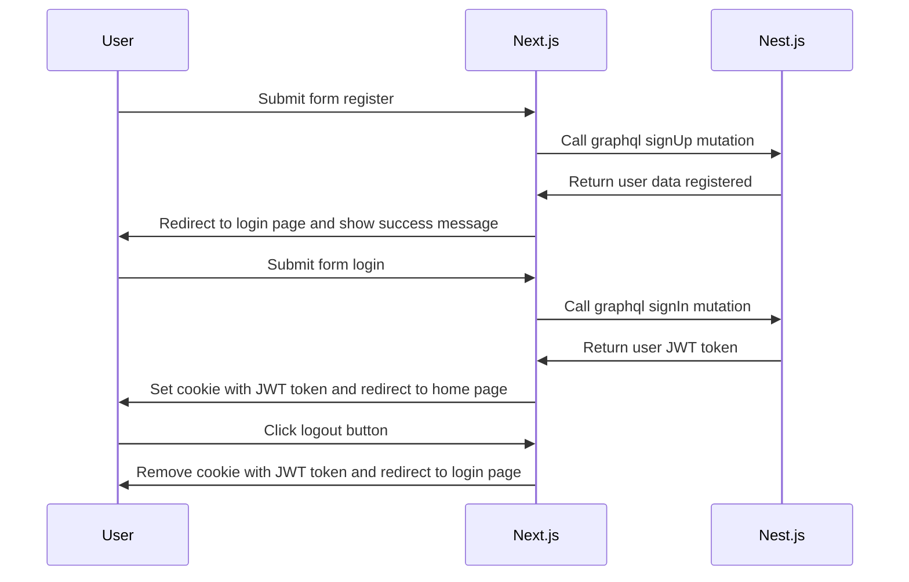

# shadcn/ui monorepo template

This template is for creating a monorepo with shadcn/ui.

## Usage

```bash
pnpm dlx shadcn@latest init
```

## Adding components

To add components to your app, run the following command at the root of your `web` app:

```bash
pnpm dlx shadcn@latest add button -c apps/web
```

This will place the ui components in the `packages/ui/src/components` directory.

## Tailwind

Your `tailwind.config.ts` and `globals.css` are already set up to use the components from the `ui` package.

## Using components

To use the components in your app, import them from the `ui` package.

```tsx
import { Button } from "@workspace/ui/components/ui/button";
```

## Todo

### Back End

- [ ] Add validation for graphql
- [ ] Add refresh token
- [ ] Add logout mutation
- [ ] Add user profile query and mutation
- [ ] Add user forgot password mutation
- [ ] Add user update password mutation (with token, after login)
- [ ] Caching?
- [ ] Microservices
- [ ] Docker for all services
- [ ] CICD for all services
- [ ] Service file upload

### Front End

- [ ] FE and BE integration, graphql code generation


## Flows


